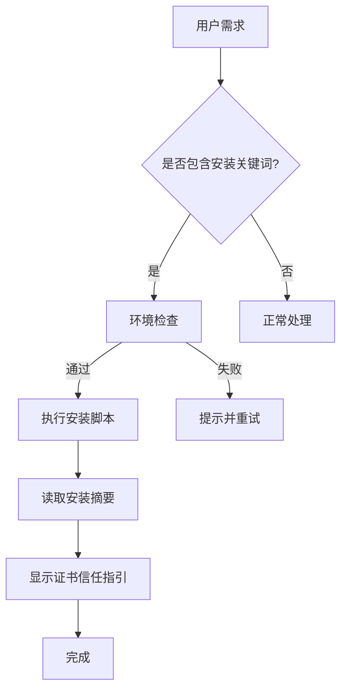

# iOS 真机自动化安装 Prompt 使用指南

## 📚 文档说明

本目录包含 iOS 真机一键安装自动化相关的 Prompt 模块文档：

| 文件 | 说明 | 适用场景 |
|------|------|---------|
| [ios_automated_installation_prompt.md](ios_automated_installation_prompt.md) | 完整版 Prompt（详细） | 需要深入了解自动化逻辑 |
| [ios_automated_installation_prompt_simple.md](ios_automated_installation_prompt_simple.md) | 简化版 Prompt（核心） | 直接集成到 AI 配置中 |
| [log_path_migration_summary.md](log_path_migration_summary.md) | 日志路径迁移总结 | 了解日志文件管理变更 |
| [certificate_trust_guide.md](certificate_trust_guide.md) | 开发者证书信任指南 | 用户操作指引 |
| [script_optimization_test_report.md](script_optimization_test_report.md) | 脚本优化测试报告 | 了解脚本改进历程 |

---

## 🚀 快速开始

### 方案一：使用简化版（推荐）

直接复制 `ios_automated_installation_prompt_simple.md` 的内容到你的 AI 配置中。

**优点**：
- ✅ 简洁明了，只包含核心逻辑
- ✅ 易于集成，不会过度膨胀 Prompt
- ✅ 覆盖 80% 的常见场景

### 方案二：使用完整版

复制 `ios_automated_installation_prompt.md` 的内容。

**优点**：
- ✅ 详尽完整，覆盖所有细节
- ✅ 包含故障排查指南
- ✅ 适合需要深度定制的场景

**建议**：将简化版作为主要配置，完整版作为参考文档。

---

## 🎯 自动化工作原理

### 触发机制

AI 会自动识别以下关键词并触发安装流程：

```
"安装到真机" | "部署到 iPhone" | "在设备上运行"
"安装失败" | "无法启动" | "证书问题"
"一键安装" | "自动化部署" | "无人值守安装"
```

### 执行流程



### 关键特性

1. **自动识别**：无需用户明确指示
2. **并行执行**：环境检查、脚本执行同时进行
3. **超时控制**：每个步骤都有超时限制
4. **自动重试**：失败后自动重试（最多3次）
5. **详细日志**：所有日志保存到 `Saved/Logs/`

---

## 📁 日志管理

### 日志文件结构

```
Saved/Logs/
├── build_20260120_093000.log        # 构建日志
├── install_20260120_093500.log      # 安装日志
└── installation_summary_20260120_093500.log  # 安装摘要
```

### Git 排除配置

`.gitignore` 中已配置：

```gitignore
# Saved directory (local files, excluded from git)
Saved/
```

**效果**：所有日志文件不会提交到 Git 仓库。

---

## ⚠️ 重要注意事项

### 1. 开发者证书信任

**这是 Apple 的系统级安全限制，无法自动化完成**

用户必须手动操作：
1. 首次启动应用时，系统提示"不受信任的开发者"
2. 进入 **设置 → 通用 → VPN 与设备管理**
3. 找到开发者证书，点击"信任"
4. 再次启动应用

AI 在安装完成后会自动提示用户完成此操作。

### 2. 免费账号限制

- 证书有效期：7天
- 需要定期重新构建
- 每个账号最多注册一台设备

**建议**：开发调试使用免费账号，团队协作考虑付费账号。

### 3. 超时控制

| 操作 | 超时时间 | 重试次数 |
|------|---------|---------|
| 设备检测 | 10秒 | 3次 |
| 项目清理 | 30秒 | 2次 |
| 依赖更新 | 60秒 | 2次 |
| 构建 | 5分钟 | 1次 |
| 部署 | 2分钟 | 2次 |

---

## 🔧 集成指南

### 步骤 1：选择 Prompt 版本

根据你的需求选择：
- **首次集成** → 使用简化版
- **需要深度定制** → 使用完整版

### 步骤 2：复制到配置

复制对应文件的内容，粘贴到你的 AI 配置文件中。

建议放在以下位置：
```markdown
## 📱 iOS 真机自动化安装

[粘贴 Prompt 内容]

---

## 📋 开发规范
[其他配置]
```

### 步骤 3：测试验证

发送测试消息：
```
"帮我安装到真机"
```

验证 AI 是否：
- ✅ 自动识别需求
- ✅ 执行安装脚本
- ✅ 显示安装摘要
- ✅ 提供证书信任指引

---

## 🎯 成功标准

AI 执行完成后，满足以下条件即视为成功：

1. **脚本执行完成**
   - 安装摘要显示"✅ 应用安装成功"
   - 设备上可见应用图标

2. **日志记录完整**
   - 构建日志：`Saved/Logs/build_*.log`
   - 安装日志：`Saved/Logs/install_*.log`
   - 安装摘要：`Saved/Logs/installation_summary_*.log`

3. **用户指引清晰**
   - 提示开发者证书信任步骤
   - 说明日志文件位置
   - 提供故障排查建议

---

## 🔄 持续优化

### 自动优化触发

当满足以下条件时，AI 会自动优化安装流程：

1. **连续3次超时**
   - 检测到某步骤经常超时
   - 自动优化该步骤的实现

2. **出现新错误模式**
   - 收集到新的错误日志
   - 添加错误检测和处理

3. **用户反馈改进**
   - 用户提出优化建议
   - 自动集成到脚本中

### 优化方向

- 🚀 缩短构建时间
- 📊 改进错误提示
- 🛡️ 增强稳定性
- 📝 完善日志记录

---

## 📊 常见问题

### Q1: AI 没有自动识别安装需求怎么办？

**A**: 确保需求包含以下关键词之一：
- "安装到真机"
- "部署到 iPhone"
- "一键安装"
- "自动化部署"

如果仍未触发，可以明确说明：
```
"请执行 iOS 真机一键安装流程"
```

### Q2: 安装失败后如何排查？

**A**: 查看日志文件：
```bash
# 构建日志
cat Saved/Logs/build_*.log

# 安装日志
cat Saved/Logs/install_*.log
```

常见问题：
- 设备未连接 → 检查 USB 线缆
- 构建失败 → 检查依赖和签名
- 无法启动 → 手动信任开发者证书

### Q3: 如何清理旧日志？

**A**: 运行以下命令：
```bash
# 删除30天前的日志
find Saved/Logs -name "*.log" -mtime +30 -delete

# 删除所有日志
rm Saved/Logs/*.log
```

### Q4: 需要定期重新安装吗？

**A**: 免费账号的证书7天后失效，需要重新运行安装脚本。

付费账号证书有效期更长，可以减少重装频率。

---

## 📞 支持

如果遇到问题，请查看：
1. [证书信任指南](certificate_trust_guide.md) - 解决"无法启动"问题
2. [脚本优化测试报告](script_optimization_test_report.md) - 了解脚本改进历程
3. [日志迁移总结](log_path_migration_summary.md) - 了解日志文件管理变更

---

## ✅ 检查清单

使用前确认：

- [ ] 设备已连接并解锁
- [ ] 脚本存在：`scripts/install_to_device.sh`
- [ ] 日志目录存在：`Saved/Logs/`
- [ ] `.gitignore` 已配置排除 `Saved/`
- [ ] 已复制 Prompt 到 AI 配置
- [ ] 了解开发者证书信任流程

---

**版本**：1.0.0  
**更新日期**：2026-01-20  
**状态**：✅ 已验证可用
