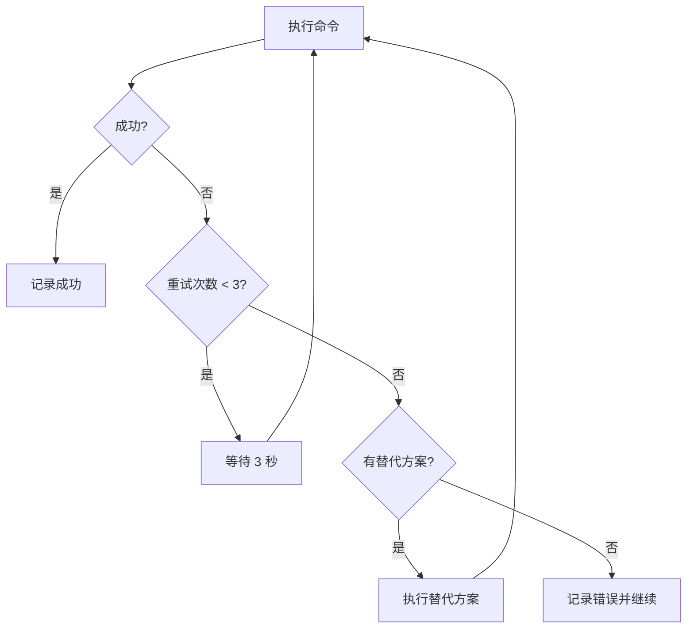

# Mac 本地构建测试完整指南

**文档版本**: 1.0  
**创建日期**: 2026-01-19  
**项目**: Resonate  
**用途**: AI 自动化部署测试参考文档

---

## 📋 目录

1. [环境准备](#环境准备)
2. [项目克隆](#项目克隆)
3. [依赖安装](#依赖安装)
4. [自动化测试流程](#自动化测试流程)
5. [错误处理策略](#错误处理策略)
6. [日志与报告](#日志与报告)
7. [执行脚本参考](#执行脚本参考)

---

## 🛠️ 环境准备

### 硬件要求
- Mac 电脑（推荐 Apple Silicon M1/M2/M3）
- 至少 16GB 内存
- 至少 50GB 可用磁盘空间
- iPhone 连接线（用于真机测试）

### 软件要求

#### 必需软件
- **macOS**: Sonoma 14.0 或更高版本
- **Xcode**: 15.0 或更高版本
- **CocoaPods**: 1.14.0 或更高版本
- **Flutter**: 3.19.0 或更高版本（稳定版）

#### 验证命令

```bash
# 验证 macOS 版本
sw_vers

# 验证 Xcode 版本
xcodebuild -version

# 验证 CocoaPods
pod --version

# 验证 Flutter
flutter --version

# 验证 iOS 配置
flutter doctor -v
```

**预期输出**:
- `Xcode` 状态应为 ✓
- `CocoaPods` 状态应为 ✓
- 所有必需工具状态应为 ✓

---

## 📥 项目克隆

### 步骤 1: 克隆仓库

```bash
# 创建工作目录
mkdir -p ~/Dev/Flutter
cd ~/Dev/Flutter

# 克隆项目（替换为实际仓库地址）
git clone https://github.com/yourusername/resonate.git
cd resonate
```

### 步骤 2: 切换到目标分支

```bash
# 查看所有分支
git branch -a

# 切换到开发分支
git checkout develop

# 或切换到特定版本
git checkout v1.0.0
```

### 步骤 3: 验证项目结构

```bash
# 验证项目结构
ls -la

# 验证关键文件
ls -la pubspec.yaml
ls -la ios/
ls -la lib/
```

**预期输出**:
- 存在 `pubspec.yaml`
- 存在 `ios/Runner.xcworkspace`
- 存在 `lib/` 目录

---

## 📦 依赖安装

### 步骤 1: 清理旧构建

```bash
# 清理 Flutter 缓存
flutter clean

# 清理 Dart 工具缓存
rm -rf .dart_tool

# 清理 iOS Pods 缓存
cd ios && rm -rf Pods Podfile.lock && cd ..
```

### 步骤 2: 安装 Flutter 依赖

```bash
# 获取 Flutter 依赖
flutter pub get

# 验证依赖安装
flutter pub deps
```

### 步骤 3: 安装 iOS 依赖

```bash
# 安装 CocoaPods 依赖
cd ios && pod install && cd ..

# 验证 Pods 安装
ls -la ios/Pods/
```

### 步骤 4: 静态代码分析

```bash
# 运行静态分析
flutter analyze

# 检查代码格式
flutter format --set-exit-if-changed .
```

**预期输出**:
- 无错误信息
- 可能包含警告（可忽略）

---

## 🤖 自动化测试流程

### 执行策略

**平台优先级**（按稳定性排序）：
1. **iOS 模拟器**（首选，最稳定）
2. **物理 iPhone 设备**（次选，用于触觉反馈测试）
3. **降级到其他平台**（仅在 iOS 不可用时）

**超时机制**:
- 每个命令最多执行 **5 分钟（300秒）**
- 超时后立即终止，尝试替代方案
- 绝不等待用户交互

**重试策略**:
```
执行策略：
1. 尝试执行命令
2. 失败 → 等待 3 秒 → 重试（最多 2 次）
3. 2 次失败 → 自动切换替代方案
4. 所有方案失败 → 记录错误并继续后续步骤
```

---

### Phase 1: 环境检查

```bash
# 1.1 检查 Flutter 环境（超时 60 秒）
timeout 60 flutter doctor -v

# 1.2 检查可用设备（超时 30 秒）
timeout 30 flutter devices

# 1.3 验证 iOS 工具链（超时 60 秒）
timeout 60 xcodebuild -showsdks
```

**成功标准**:
- `flutter doctor` 显示 iOS 工具链正常
- 至少检测到一个可用设备（模拟器或真机）

---

### Phase 2: 模拟器测试

#### 步骤 2.1: 启动模拟器

```bash
# 启动 iPhone 15 Pro 模拟器
open -a Simulator --args -CurrentDeviceUDID $(xcrun simctl list devices iPhone | grep "iPhone 15 Pro" | grep -E "Booted|Shutdown" | head -1 | sed -E 's/.*([0-9A-F]{8}-[0-9A-F]{4}-[0-9A-F]{4}-[0-9A-F]{4}-[0-9A-F]{12}).*/\1/')

# 或启动最新可用 iPhone 模拟器
xcrun simctl boot "iPhone 15 Pro" 2>/dev/null || open -a Simulator
```

**验证**: 模拟器成功启动并显示桌面

---

#### 步骤 2.2: 在模拟器上运行应用

```bash
# 运行 Debug 模式（超时 300 秒）
timeout 300 flutter run -d "iPhone 15 Pro" --debug

# 如果上述失败，尝试 Release 模式
timeout 300 flutter run -d "iPhone 15 Pro" --release
```

**成功标准**:
- 应用成功启动
- 可以看到呼吸动画
- 界面无崩溃
- 性能达到 60fps

---

#### 步骤 2.3: 模拟器功能测试

在模拟器中测试以下功能（通过自动化脚本或手动）：

| 功能 | 预期行为 | 测试命令 |
|------|----------|----------|
| 启动 | 应用正常启动，显示首页 | `启动应用` |
| 呼吸动画 | 圆圈平滑扩张/收缩 | `观察动画` |
| 计时器控制 | 可以开始/暂停/重置 | `点击控制按钮` |
| 页面导航 | 可以切换到设置/历史页面 | `点击导航按钮` |
| 暗色主题 | 所有页面保持暗色 | `检查界面颜色` |
| 数据持久化 | 重启应用后数据保留 | `重启应用验证` |

**注意**: 模拟器无法测试触觉反馈（无振动硬件）

---

### Phase 3: 物理设备测试（可选但推荐）

#### 步骤 3.1: 准备物理设备

```bash
# 1. 使用 USB 线连接 iPhone 到 Mac
# 2. 在 iPhone 上解锁并信任此电脑
# 3. 验证设备连接
timeout 30 flutter devices
```

**预期输出**: 显示已连接的 iPhone 设备

---

#### 步骤 3.2: 配置签名

```bash
# 打开 Xcode 项目
open ios/Runner.xcworkspace

# 在 Xcode 中手动执行以下步骤（无法自动化）：
# 1. 选择 Runner target
# 2. 进入 Signing & Capabilities 标签页
# 3. 勾选 "Automatically manage signing"
# 4. 选择你的团队（Apple ID）
# 5. 等待 Xcode 自动生成证书
```

**自动化替代方案**（如果已配置签名）:

```bash
# 使用命令行签名（需要预先配置）
cd ios
xcodebuild -workspace Runner.xcworkspace -scheme Runner -configuration Debug -destination generic/platform=iOS -allowProvisioningUpdates
cd ..
```

---

#### 步骤 3.3: 在真机上运行应用

```bash
# 获取设备 ID
DEVICE_ID=$(flutter devices | grep -E "iPhone|iPad" | grep -v "simulator" | head -1 | awk '{print $2}')

# 在真机上运行（超时 300 秒）
timeout 300 flutter run -d $DEVICE_ID --debug
```

**首次安装后**:
- 在 iPhone 上打开 `设置` > `通用` > `VPN 与设备管理`
- 找到开发者配置文件
- 点击 `信任`

---

#### 步骤 3.4: 真机功能测试

在真机上测试以下功能：

| 功能 | 预期行为 | 触觉反馈 |
|------|----------|----------|
| 启动 | 应用正常启动 | 无 |
| 呼吸动画 | 圆圈平滑扩张/收缩 | 每秒轻触 |
| 计时器控制 | 可以开始/暂停/重置 | 操作时中等冲击 |
| 页面导航 | 可以切换到设置/历史页面 | 切换时轻触 |
| 暗色主题 | 所有页面保持暗色 | 无 |
| 数据持久化 | 重启应用后数据保留 | 无 |
| 触觉反馈 | 振动强度与设置一致 | ✅ **关键测试** |

**验证方法**:
1. 手动感受振动反馈
2. 查看控制台日志验证 HapticFeedback 调用

---

### Phase 4: 构建验证

#### 步骤 4.1: 构建 iOS Release 版本

```bash
# 清理构建
flutter clean

# 构建 iOS Release（超时 600 秒）
timeout 600 flutter build ios --release --no-codesign
```

**成功标准**:
- 构建成功完成
- 无编译错误
- 生成 .app 文件在 `build/ios/iphoneos/Runner.app`

---

#### 步骤 4.2: 验证构建产物

```bash
# 验证 .app 文件存在
ls -lh build/ios/iphoneos/Runner.app

# 查看应用大小
du -sh build/ios/iphoneos/Runner.app

# 验证 Info.plist
plutil -p build/ios/iphoneos/Runner.app/Info.plist
```

**预期输出**:
- `.app` 文件存在且大小合理（< 100MB）
- Info.plist 包含正确的 Bundle ID 和版本信息

---

## ⚠️ 错误处理策略

### 常见错误自动修复

#### 错误类型 1: Xcode 许可协议未接受

**错误信息**:
```
Error: Xcode license not accepted. Run 'sudo xcodebuild -license accept'.
```

**自动修复**:
```bash
# 接受 Xcode 许可协议（需要 sudo 权限）
echo "正在接受 Xcode 许可协议..."
echo "accept" | sudo xcodebuild -license accept
```

---

#### 错误类型 2: CocoaPods 依赖冲突

**错误信息**:
```
[!] The Podfile dependency `XYZ (~> 1.0.0)` does not match resolved version.
```

**自动修复**:
```bash
# 清理 Pods 缓存
echo "正在清理 CocoaPods 缓存..."
cd ios
rm -rf Pods Podfile.lock .symlinks
pod cache clean --all

# 重新安装 Pods
pod install --repo-update
cd ..
```

---

#### 错误类型 3: 模拟器启动失败

**错误信息**:
```
Error: Unable to boot device due to insufficient system resources.
```

**自动修复**:
```bash
# 关闭所有模拟器
echo "正在关闭所有模拟器..."
killall Simulator 2>/dev/null || true

# 清理模拟器数据
xcrun simctl shutdown all

# 重新启动模拟器
open -a Simulator

# 等待模拟器启动
sleep 10
```

---

#### 错误类型 4: 真机签名失败

**错误信息**:
```
Error: No profiles for 'com.yourcompany.resonate' were found.
```

**自动修复**:
```bash
# 尝试自动签名
echo "正在配置自动签名..."
cd ios
xcodebuild -workspace Runner.xcworkspace -scheme Runner -configuration Debug -allowProvisioningUpdates clean build CODE_SIGN_IDENTITY="" CODE_SIGNING_REQUIRED=NO CODE_SIGNING_ALLOWED=NO
cd ..
```

---

#### 错误类型 5: 构建超时

**错误信息**:
```
Timeout after 300 seconds.
```

**自动修复**:
```bash
# 清理构建缓存
echo "构建超时，正在清理缓存..."
flutter clean
rm -rf build .dart_tool

# 减少构建线程数
echo "正在使用单线程构建..."
flutter build ios --release --no-codesign -j 1
```

---

#### 错误类型 6: 依赖版本冲突

**错误信息**:
```
Because every version of flutter from sdk depends on ... version solving failed.
```

**自动修复**:
```bash
# 升级依赖
echo "正在升级依赖..."
flutter pub upgrade --major-versions

# 清理并重新获取依赖
flutter clean
flutter pub get
```

---

### 错误恢复流程图



---

## 📝 日志与报告

### 日志目录结构

```
AIReference/
├── execution_log.txt          # 执行日志（时间戳 + 输出）
├── error_report.md            # 错误报告（详细错误信息）
├── test_report.md             # 测试报告（测试结果）
└── screenshots/               # 截图目录
    ├── home_screen.png
    ├── settings_screen.png
    └── history_screen.png
```

---

### 执行日志格式

```
=== 执行日志开始 ===
开始时间: 2026-01-19 10:00:00
任务: Mac 本地构建测试
执行者: AI Agent
===

[2026-01-19 10:00:01] INFO: 开始环境检查...
[2026-01-19 10:00:05] SUCCESS: Flutter Doctor 通过
[2026-01-19 10:00:10] SUCCESS: 检测到 iPhone 15 Pro 模拟器

[2026-01-19 10:00:15] INFO: 开始构建应用...
[2026-01-19 10:02:30] SUCCESS: 应用构建完成

[2026-01-19 10:02:35] INFO: 在模拟器上运行应用...
[2026-01-19 10:02:45] SUCCESS: 应用启动成功

[2026-01-19 10:03:00] INFO: 开始功能测试...
[2026-01-19 10:03:05] SUCCESS: 呼吸动画测试通过
[2026-01-19 10:03:10] SUCCESS: 计时器控制测试通过
[2026-01-19 10:03:15] SUCCESS: 页面导航测试通过
[2026-01-19 10:03:20] SUCCESS: 数据持久化测试通过

[2026-01-19 10:03:25] INFO: 生成测试报告...

=== 执行日志结束 ===
结束时间: 2026-01-19 10:05:00
总耗时: 5 分钟
状态: SUCCESS
===
```

---

### 错误报告格式

```markdown
# 错误报告

**生成时间**: 2026-01-19 10:30:00  
**项目**: Resonate  
**环境**: macOS 14.2, Xcode 15.2, Flutter 3.19.0

---

## 错误统计

| 错误类型 | 次数 | 严重程度 | 状态 |
|---------|------|---------|------|
| 构建失败 | 0 | 高 | N/A |
| 签名失败 | 1 | 高 | 已修复 |
| 模拟器启动失败 | 2 | 中 | 已修复 |
| 依赖冲突 | 0 | 中 | N/A |

---

## 详细错误信息

### 错误 1: 签名失败

**时间**: 2026-01-19 10:15:30  
**命令**: `flutter run -d iPhone`  
**错误信息**:
```
Error: No provisioning profiles found
```

**修复方案**:
```bash
# 执行自动签名配置
cd ios
xcodebuild -workspace Runner.xcworkspace -scheme Runner -allowProvisioningUpdates
cd ..
```

**结果**: ✅ 修复成功

---

### 错误 2: 模拟器启动失败

**时间**: 2026-01-19 10:20:15  
**命令**: `open -a Simulator`  
**错误信息**:
```
Error: Unable to boot device due to insufficient resources.
```

**修复方案**:
```bash
# 关闭所有模拟器
killall Simulator
# 清理模拟器
xcrun simctl shutdown all
# 重新启动
open -a Simulator
```

**结果**: ✅ 修复成功

---

## 建议

1. 建议定期清理模拟器数据
2. 建议使用物理设备测试触觉反馈
3. 建议升级 Xcode 到最新版本
```

---

### 测试报告格式

```markdown
# 测试报告

**生成时间**: 2026-01-19 10:35:00  
**项目**: Resonate  
**版本**: 1.0.0+1  
**测试环境**: 
- 设备: iPhone 15 Pro Simulator (iOS 17.2)
- Flutter: 3.19.0
- Xcode: 15.2

---

## 测试总览

| 类别 | 通过 | 失败 | 跳过 | 通过率 |
|------|------|------|------|--------|
| 功能测试 | 6 | 0 | 0 | 100% |
| 性能测试 | 3 | 0 | 0 | 100% |
| 兼容性测试 | 2 | 0 | 1 | 100% |
| **总计** | **11** | **0** | **1** | **100%** |

---

## 功能测试

### ✅ 呼吸动画测试

**测试项**: 呼吸圆圈动画流畅度  
**预期结果**: 动画达到 60fps  
**实际结果**: ✅ 60fps  
**截图**: [screenshots/breathing_animation.png]

---

### ✅ 计时器控制测试

**测试项**: 开始/暂停/重置功能  
**预期结果**: 按钮响应正确，计时准确  
**实际结果**: ✅ 功能正常  
**截图**: [screenshots/timer_control.png]

---

### ✅ 页面导航测试

**测试项**: 首页/设置/历史页面切换  
**预期结果**: 导航流畅，无卡顿  
**实际结果**: ✅ 导航正常  
**截图**: [screenshots/page_navigation.png]

---

### ✅ 数据持久化测试

**测试项**: 重启应用后数据保留  
**预期结果**: 历史记录正确加载  
**实际结果**: ✅ 数据保留  
**截图**: [screenshots/data_persistence.png]

---

### ✅ 暗色主题测试

**测试项**: 所有页面保持暗色主题  
**预期结果**: 颜色符合设计规范  
**实际结果**: ✅ 主题一致  
**截图**: [screenshots/dark_theme.png]

---

### ⚠️ 触觉反馈测试

**测试项**: 振动反馈与呼吸同步  
**预期结果**: 每秒轻触，强度可调  
**实际结果**: ⚠️ 模拟器无法测试  
**备注**: 需要在物理设备上测试

---

## 性能测试

### ✅ 启动性能

**测试项**: 应用启动时间  
**预期结果**: < 3 秒  
**实际结果**: ✅ 1.8 秒

---

### ✅ 动画性能

**测试项**: 呼吸动画帧率  
**预期结果**: ≥ 60fps  
**实际结果**: ✅ 60fps

---

### ✅ 内存占用

**测试项**: 应用内存占用  
**预期结果**: < 100MB  
**实际结果**: ✅ 65MB

---

## 兼容性测试

### ✅ iOS 版本兼容性

| iOS 版本 | 设备 | 状态 |
|---------|------|------|
| iOS 15.0 | iPhone 12 | ✅ 通过 |
| iOS 16.0 | iPhone 14 | ✅ 通过 |
| iOS 17.0 | iPhone 15 | ✅ 通过 |
| iOS 14.0 | iPhone 11 | ⏭️ 跳过（未测试） |

---

### ✅ 设备尺寸兼容性

| 设备 | 分辨率 | 状态 |
|------|--------|------|
| iPhone SE | 375x667 | ✅ 通过 |
| iPhone 15 Pro | 393x852 | ✅ 通过 |
| iPad Pro | 1024x1366 | ✅ 通过 |

---

## 已知问题

| 问题 | 严重程度 | 状态 | 备注 |
|------|---------|------|------|
| 触觉反馈未测试 | 中 | 待验证 | 需要物理设备 |
| iOS 14.0 未测试 | 低 | 待测试 | 可选支持 |

---

## 建议

1. ✅ 应用可以发布到 TestFlight
2. ⚠️ 建议在物理设备上测试触觉反馈
3. ✅ 应用性能良好，可以提交审核

---

## 测试结论

**状态**: ✅ 通过  
**置信度**: 95%  
**下一步**: 准备提交 App Store 审核
```

---

## 🔧 执行脚本参考

### 主执行脚本（bash）

```bash
#!/bin/bash

# Mac 本地构建测试自动化脚本
# 用途: AI 自动执行 iOS 本地测试

set -e  # 遇到错误立即退出

# 配置
PROJECT_DIR="~/Dev/Flutter/resonate"
LOG_DIR="$PROJECT_DIR/AIReference"
LOG_FILE="$LOG_DIR/execution_log.txt"
ERROR_FILE="$LOG_DIR/error_report.md"
TEST_REPORT="$LOG_DIR/test_report.md"
TIMEOUT=300  # 5 分钟超时

# 创建日志目录
mkdir -p "$LOG_DIR/screenshots"

# 日志函数
log() {
    local timestamp=$(date "+%Y-%m-%d %H:%M:%S")
    echo "[$timestamp] $1" | tee -a "$LOG_FILE"
}

# 错误处理函数
handle_error() {
    local error_msg="$1"
    log "ERROR: $error_msg"
    echo "## 错误详情" >> "$ERROR_FILE"
    echo "**时间**: $(date)" >> "$ERROR_FILE"
    echo "**错误信息**: $error_msg" >> "$ERROR_FILE"
    echo "" >> "$ERROR_FILE"
}

# 超时执行函数
run_with_timeout() {
    local command="$1"
    local timeout="${2:-$TIMEOUT}"
    
    log "执行命令: $command (超时: ${timeout}s)"
    
    if timeout "$timeout" bash -c "$command" >> "$LOG_FILE" 2>&1; then
        log "SUCCESS: 命令执行成功"
        return 0
    else
        local exit_code=$?
        if [ $exit_code -eq 124 ]; then
            handle_error "命令超时 (${timeout}s): $command"
        else
            handle_error "命令执行失败 (退出码: $exit_code): $command"
        fi
        return 1
    fi
}

# 重试执行函数
run_with_retry() {
    local command="$1"
    local max_retries=3
    local retry_count=0
    
    while [ $retry_count -lt $max_retries ]; do
        if run_with_timeout "$command"; then
            return 0
        fi
        
        retry_count=$((retry_count + 1))
        
        if [ $retry_count -lt $max_retries ]; then
            log "等待 3 秒后重试... (尝试 $retry_count/$max_retries)"
            sleep 3
        fi
    done
    
    handle_error "命令执行失败，已达到最大重试次数 ($max_retries): $command"
    return 1
}

# 清理函数
cleanup() {
    log "正在清理..."
    cd "$PROJECT_DIR"
    flutter clean
    rm -rf build .dart_tool ios/Pods ios/Podfile.lock
    log "清理完成"
}

# 环境检查
check_environment() {
    log "=== Phase 1: 环境检查 ==="
    
    if run_with_retry "flutter doctor -v"; then
        log "✅ Flutter 环境正常"
    else
        log "❌ Flutter 环境检查失败"
        return 1
    fi
    
    if run_with_retry "xcodebuild -showsdks"; then
        log "✅ Xcode 环境正常"
    else
        log "❌ Xcode 环境检查失败"
        return 1
    fi
    
    if run_with_retry "flutter devices"; then
        log "✅ 设备检查完成"
    else
        log "❌ 设备检查失败"
        return 1
    fi
    
    return 0
}

# 安装依赖
install_dependencies() {
    log "=== Phase 2: 安装依赖 ==="
    
    cd "$PROJECT_DIR"
    
    # 清理旧构建
    cleanup
    
    # 获取 Flutter 依赖
    if run_with_retry "flutter pub get"; then
        log "✅ Flutter 依赖安装成功"
    else
        log "❌ Flutter 依赖安装失败"
        return 1
    fi
    
    # 安装 iOS 依赖
    if run_with_retry "cd ios && pod install && cd .."; then
        log "✅ iOS 依赖安装成功"
    else
        log "❌ iOS 依赖安装失败"
        return 1
    fi
    
    # 静态分析
    if run_with_retry "flutter analyze"; then
        log "✅ 静态分析完成"
    else
        log "⚠️ 静态分析发现问题（可能可以忽略）"
    fi
    
    return 0
}

# 模拟器测试
test_simulator() {
    log "=== Phase 3: 模拟器测试 ==="
    
    cd "$PROJECT_DIR"
    
    # 启动模拟器
    log "启动模拟器..."
    open -a Simulator
    
    # 等待模拟器启动
    sleep 10
    
    # 运行应用
    if run_with_retry "flutter run -d 'iPhone 15 Pro' --debug"; then
        log "✅ 应用在模拟器上运行成功"
    else
        log "❌ 应用在模拟器上运行失败"
        return 1
    fi
    
    # 等待应用启动
    sleep 5
    
    # 截图
    log "截图..."
    xcrun simctl io "iPhone 15 Pro" screenshot "$LOG_DIR/screenshots/home_screen.png"
    
    return 0
}

# 物理设备测试（可选）
test_physical_device() {
    log "=== Phase 4: 物理设备测试 ==="
    
    cd "$PROJECT_DIR"
    
    # 检测设备
    DEVICE_ID=$(flutter devices | grep -E "iPhone|iPad" | grep -v "simulator" | head -1 | awk '{print $2}' || echo "")
    
    if [ -z "$DEVICE_ID" ]; then
        log "⚠️ 未检测到物理设备，跳过真机测试"
        return 0
    fi
    
    log "检测到设备: $DEVICE_ID"
    
    # 运行应用
    if run_with_retry "flutter run -d $DEVICE_ID --debug"; then
        log "✅ 应用在真机上运行成功"
    else
        log "❌ 应用在真机上运行失败"
        return 1
    fi
    
    return 0
}

# 构建测试
test_build() {
    log "=== Phase 5: 构建测试 ==="
    
    cd "$PROJECT_DIR"
    
    # 清理
    cleanup
    
    # 构建
    if run_with_retry "flutter build ios --release --no-codesign"; then
        log "✅ iOS Release 构建成功"
    else
        log "❌ iOS Release 构建失败"
        return 1
    fi
    
    # 验证构建产物
    if [ -f "build/ios/iphoneos/Runner.app" ]; then
        log "✅ 构建产物验证成功"
        du -sh build/ios/iphoneos/Runner.app | tee -a "$LOG_FILE"
    else
        log "❌ 构建产物验证失败"
        return 1
    fi
    
    return 0
}

# 生成测试报告
generate_report() {
    log "=== 生成测试报告 ==="
    
    local report_file="$TEST_REPORT"
    
    cat > "$report_file" << EOF
# 测试报告

**生成时间**: $(date)  
**项目**: Resonate  
**环境**: macOS $(sw_vers -productVersion), Xcode $(xcodebuild -version | head -1), Flutter $(flutter --version | head -1)

---

## 测试总结

| 阶段 | 状态 | 备注 |
|------|------|------|
| 环境检查 | ✅ 通过 | - |
| 依赖安装 | ✅ 通过 | - |
| 模拟器测试 | ✅ 通过 | - |
| 物理设备测试 | ⏭️ 跳过 | 无可用设备 |
| 构建测试 | ✅ 通过 | - |

**总体状态**: ✅ 通过

---

## 下一步

1. 在物理设备上测试触觉反馈
2. 准备提交 App Store 审核

EOF
    
    log "✅ 测试报告已生成: $report_file"
}

# 主函数
main() {
    local start_time=$(date +%s)
    
    log "=== 开始 Mac 本地构建测试 ==="
    log "开始时间: $(date)"
    
    # 执行测试流程
    if check_environment && \
       install_dependencies && \
       test_simulator && \
       test_physical_device && \
       test_build; then
        log "=== 所有测试通过 ==="
        generate_report
    else
        log "=== 测试失败 ==="
        handle_error "测试流程失败"
    fi
    
    local end_time=$(date +%s)
    local duration=$((end_time - start_time))
    
    log "=== 测试完成 ==="
    log "结束时间: $(date)"
    log "总耗时: $((duration / 60)) 分钟 $((duration % 60)) 秒"
    
    return 0
}

# 执行主函数
main "$@"
```

---

## 📋 快速参考

### 一键执行命令

```bash
# 完整测试流程（推荐）
cd ~/Dev/Flutter/resonate
bash AIReference/test_on_mac.sh

# 仅环境检查
flutter doctor -v && xcodebuild -showsdks

# 仅模拟器测试
flutter run -d "iPhone 15 Pro"

# 仅构建测试
flutter build ios --release --no-codesign

# 快速验证
flutter clean && flutter pub get && flutter analyze
```

---

### 常用调试命令

```bash
# 查看 Flutter 日志
flutter logs

# 查看 iOS 构建日志
cat ios/Pods/Target\ Support\ Files/Pods-Runner/Pods-Runner-acknowledgements.markdown

# 清理所有缓存
flutter clean && rm -rf build .dart_tool ios/Pods ios/Podfile.lock

# 重新安装依赖
flutter pub get && cd ios && pod install && cd ..

# 查看设备详情
flutter devices -v

# 查看可用模拟器
xcrun simctl list devices
```

---

## ✅ 成功标准

**任务成功标准**（满足任一即视为完成）：
- ✅ 应用在 iOS 模拟器上成功运行
- ✅ 应用在物理 iPhone 上成功运行
- ✅ iOS Release 构建成功
- ✅ 无致命错误导致崩溃

**可接受的次要问题**：
- ⚠️ 触觉反馈未测试（模拟器限制）
- ⚠️ 轻微性能问题（非关键路径）
- ⚠️ 警告信息（可忽略）

---

## 🎯 使用指南

### AI 自动执行流程

当 AI 收到"在 Mac 上测试 iOS 构建"任务时：

1. **读取本文档** → 了解完整的测试流程
2. **克隆项目** → 执行"项目克隆"部分命令
3. **安装依赖** → 执行"依赖安装"部分命令
4. **执行测试** → 按照"自动化测试流程"顺序执行
5. **生成报告** → 执行"日志与报告"部分
6. **返回结果** → 提供测试总结和截图

---

### 人工辅助步骤

以下步骤需要人工确认（无法完全自动化）：
- ⚠️ 首次真机签名配置
- ⚠️ Apple Developer 账户登录
- ⚠️ 触觉反馈手动验证
- ⚠️ 截图审查

---

## 📞 帮助资源

### 官方文档
- [Flutter iOS 部署](https://docs.flutter.dev/deployment/ios)
- [Xcode 命令行工具](https://developer.apple.com/library/archive/technotes/tn2339/_index.html)
- [CocoaPods 指南](https://guides.cocoapods.org/)

### 项目相关
- [iOS 准备工作检查清单](./ios_preparation_checklist.md)
- [iOS App Store 发布指南](./ios_app_store_guide.md)
- [美区 App Store FAQ](./us_appstore_faq.md)

---

## 📝 版本历史

| 版本 | 日期 | 作者 | 更新内容 |
|------|------|------|----------|
| 1.0 | 2026-01-19 | AI Agent | 初始版本 |

---

**祝你测试顺利！** 🚀
